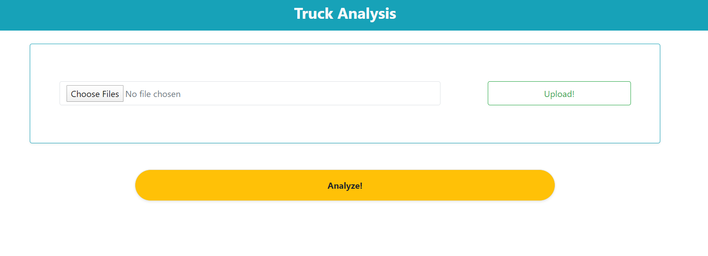

# BCIT_Hackathon

**Project**: Analysing mining data to improve efficiency

Tool asks for three files to be uploaded and shows to the user the efficiency of each truck and which truck is currently effecting the productivity.

Tech stack: React, Nodejs

**Home Page** 

User needs to add files for analysis

**Analysis results**

